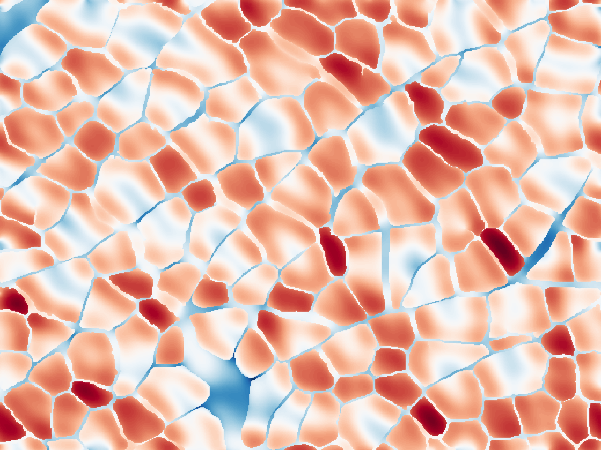

UNDER CONSTRUCTION1

<figure style="float: right;">
     
<figcaption>skeletal muscle microstructure</figcaption>
</figure>

My current research focus is on non-invasively measuring the microstructure of skeletal muscle. Muscle microstructure is a description of how muscle cells are organized. Muscle consists of long fibers that are tightly packed together and surrounded by an extracellular collagen matrix. Changes in this microstructure have been related to changes in muscle health so non-invasive measurement of this microstrucutre should provide new diagnostic tools for assessing muscle health. 

I am working on measuring this microstrucutre using diffusion-weighted magnetic resonance imaging (dMRI). Then, using these estimations of microstructure from the dMRI, I am working to develop mechancial models of muscle microstructure to the muscle’s mechancial properties are affected by changes in the microstructure. This work can be broadly organized as three separate but interrelated problems:  

&nbsp;&nbsp;&nbsp;&nbsp;&nbsp;&nbsp;[The Forward Problem](#forward-problem)

&nbsp;&nbsp;&nbsp;&nbsp;&nbsp;&nbsp;[The Inverse Problem](#inverse-problem)

&nbsp;&nbsp;&nbsp;&nbsp;&nbsp;&nbsp;[The Mechanical Problem](#mechanical-problem)

The following is a brief video explaining how we can measure muscle microstrucutre using dMRI signal. 

&nbsp;

<iframe width="560" height="315" src="https://www.youtube.com/embed/KDJG7JLhH2M" frameborder="0" allow="accelerometer; autoplay; encrypted-media; gyroscope; picture-in-picture" allowfullscreen></iframe>

# Forward Problem

{:.lead data-width="800" data-height="100"}
A caption for an image.
{:.figure}

This is the numerical solution of the Bloch-Torrey equation.  We can look at how different structures lead to different dMRI measurments, both with histology and simplified muscle models. We use the lattice Boltzmann method to solve the BT equation. 

# Inverse Problem

How do we go from the dMRI signal to the underlying structure? This includes various modeling attempts such as response surfaces and machine learning. 
Image ideas: Difficult to create a graphical representation since this is mostly about predicting a single value, however, the idea of sensitivity to the signal might yield good visualization. 

# Mechanical Problem

If we can predict microstructural information, then how does this help us understand the mechanics of muscle? We use a simple mechancial model to see which parameters most effect muscle properties. We also need to measure properties of the muscle. 

